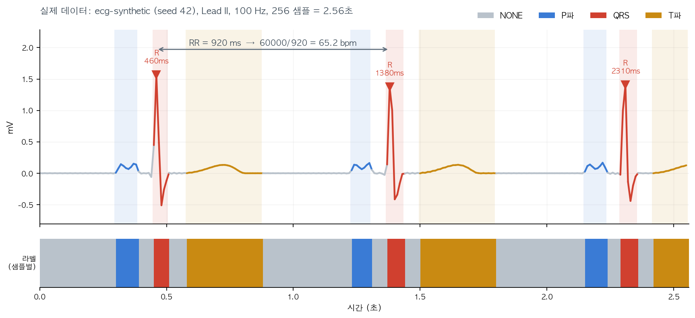

# heartKIT 쉽게 이해하기 (비유로 설명)

> [HEARTKIT-LEARNING-PLAN.ko.md](HEARTKIT-LEARNING-PLAN.ko.md)의 기술적인 내용을 비유를 써서 쉽게 풀어쓴 버전.
> 정확한 수치·코드 근거는 그 문서를 참고. 여긴 "감 잡기"용.

---

## 1. heartKIT이 뭐하는 물건인가 — 큰 그림

heartKIT은 **"심장 박동 신호(심전도)를 보고 이상을 판단하는 AI를 만들고, 그 AI를 손목시계만한 작은 칩에 넣어서 실제로 돌리는" 도구모음**이다.

- **PC에서 AI를 훈련시키는 것** = 요리사가 주방(강력한 컴퓨터)에서 레시피를 개발하는 것
- **작은 칩(Apollo510B)에 넣어서 돌리는 것** = 그 레시피를 캠핑용 미니 버너로도 만들 수 있게 압축하는 것

---

## 2. 이 도구모음은 어떻게 짜여 있나 — 요리책 비유

- **7개 태스크**(부정맥 찾기, 심장박동 구간 나누기, 노이즈 제거 등) = 요리책의 **7개 챕터**
- **5개 모드**(다운로드/학습/평가/내보내기/데모) = 각 챕터마다 반복되는 순서 — **재료 사기 → 요리하기 → 맛보기 → 포장하기 → 시식회**
- **백엔드(pc/evb)** = 이 요리를 "주방에서 시연"할지 "실제로 캠핑버너에 올려서" 할지 선택하는 스위치

| 모드 | 비유 |
| --- | --- |
| download | 장보기 |
| train | 요리하기 |
| evaluate | 맛보기(품질 검사) |
| export | 포장/소분하기 (압축해서 작은 통에 담기) |
| demo | 시식회 (실제로 손님 앞에서 내놓기) |

7개 챕터(태스크) 전부가 이 5단계 순서를 똑같이 따른다. 그래서 명령어를 칠 때 챕터 이름(`-t rhythm`, `-t beat` ...)만 바뀌고 순서(`-m train`, `-m evaluate` ...)는 항상 똑같다.

### 7개 챕터, 한 줄씩

| 챕터 | 무슨 요리인가 |
| --- | --- |
| Denoise | 잡음 낀 신호를 깨끗하게 세탁하기 |
| Segmentation | 신호를 구간별로 색칠 구분하기 (아래 5번에서 실제 데이터로 자세히) |
| Rhythm | 심장 리듬이 정상인지, 부정맥(AFIB 등)인지 판정 |
| Beat | 박동 하나하나가 정상인지 이상인지(PAC/PVC) 판정 |
| Diagnostic | 심전도로 질병 카테고리(심근경색 등) 진단 |
| Foundation | 다른 챕터들이 쓸 "기초 체력" 만들기 — 축구·농구 배우기 전에 체력훈련부터 |
| Translate | 한 종류 신호를 다른 종류로 통역 (ECG ↔ PPG) |

---

## 3. AI를 작게 압축하기 — 사진 압축 비유

AI가 크고 정교할수록 정확하지만, 작은 칩에는 안 들어간다. 그래서 압축(양자화)을 한다. 이건 **사진을 고화질 원본에서 저화질 JPG로 저장하는 것**과 똑같다 — 파일은 작아지지만 화질(정확도)이 살짝 떨어진다.

**직접 실험한 결과** (실제 크기의 부정맥 판별 AI로):

| | 원본(고화질) | 압축본(저화질) |
| --- | --- | --- |
| 파일 크기 | 90.4KB | 63.8KB (**29% 감소**) |
| 정확도 | 98.60% | 98.35% (**겨우 0.25%p만 하락**) |

**놀라운 발견**: "압축하면 무조건 크기가 1/4로 준다"는 말이 있는데, 실제로는 29%만 줄었다. 사진으로 치면, **사진 데이터는 압축되지만 액자(파일의 구조 정보)는 그대로**라서 전체 절감폭이 기대보다 작은 것이다.

---

## 4. 실제 손목시계만한 칩에 올리기 — 탐정 이야기

이 부분이 제일 험난했다. 순서대로:

1. 공식 설명서를 따라가려 했더니, 설명서가 가리키는 폴더가 **아예 존재하지 않았다.** (오래된 지도를 들고 이미 없어진 건물을 찾아간 셈)
2. 알고 보니 방식이 완전히 바뀌어 있었다. 예전엔 "AI 모델마다 칩 프로그램을 통째로 새로 구워야" 했는데, 지금은 **"칩에 범용 프로그램 하나만 넣어두고, 컴퓨터가 필요할 때마다 모델을 무선/유선으로 보내주는"** 방식으로 바뀌었다. (매번 새 앱을 설치하던 걸, 앱 하나 깔아두고 파일만 넣어주는 방식으로 바꾼 것과 비슷)
3. 그 "범용 프로그램"의 진짜 위치를 GitHub 코드를 뒤지고 뒤져서 찾아냈다 — 완전히 **다른 저장소**에 있었다.
4. 근데 그 저장소가 참조하는 부품 목록이 오래된 거라 사용자의 최신 보드(Apollo510B)를 아예 몰랐다.
5. 최신 부품 목록으로 직접 시험해보니 — **제품 상자엔 "510B"라고 써있지만 시스템 등록명은 "510"**이었다는 걸 발견! 이름표 오타 하나 잡아서 기본 조립(SDK 빌드)은 성공시켰다.

**지금 남은 일**: 기본 부품(SDK)은 새 보드를 지원한다는 게 확인됐지만, 실제 데모 프로그램 자체는 옛날 버전 부품 기준으로 짜여 있어서 최신 부품에 맞게 다시 짜맞추는(포팅) 작업이 남아있다. 시간이 걸릴 것 같아서 잠시 미뤄뒀다.

---

## 5. Segmentation은 "사진 색칠"과 똑같다 — 실제 데이터로 확인

세그멘테이션(챕터 2)이 "연속된 신호를 몇 개 구간으로 나누는 것"이라길래 "박동 하나하나에 라벨을 붙이는 건가?" 싶을 수 있는데, **아니다.**

실제로는 신호의 **매 순간(샘플)마다** "지금 이 지점은 P파냐, QRS냐, T파냐, 아무것도 아니냐"를 하나하나 색칠한다. 말로만 하면 안 와닿으니 **진짜 데이터를 뽑아서** 보자. 아래 숫자는 전부 실제로 생성한 값이고, 5-7의 코드를 그대로 실행하면 똑같이 재현된다.

### 5-1. 재료 — 2.56초짜리 심전도 한 토막

heartKIT의 합성 데이터셋(`ecg-synthetic`)으로 정상동조율(SR, 65 bpm) 심전도를 만들고, Lead II에서 **100 Hz로 256 샘플**(= 2.56초, 세그멘테이션 모델의 기본 입력 크기)을 잘라냈다. 이 안에 박동이 3개 들어있다.



위가 원본 신호(구간별로 색을 입힌 것), 아래 띠가 **모델이 내놓아야 할 정답 라벨 256개**다. 신호 한 줄에 라벨 한 줄이 통째로 대응한다는 게 핵심이다.

### 5-2. 라벨은 이렇게 생겼다 — 진짜 256개 숫자

이게 실제 정답 배열이다. 왼쪽 숫자는 샘플 번호(1칸 = 10 ms).

```
  0  0000000000000000000000000000001111111110000002222220000000333333
 64  3333333333333333333333330000000000000000000000000000000000011111
128  1110000002222222000000333333333333333333333333333333000000000000
192  0000000000000000000000011111111100000222222200000033333333333333

0 = NONE(배경)   1 = P파   2 = QRS   3 = T파
```

`000...`(평평한 대기 구간) → `111111111`(P파) → `000`(잠깐 쉼) → `222222`(QRS) → `000` → `333...`(T파). 이 순서가 **세 번 반복**되는 게 눈으로 보인다. 한 번 반복이 심장이 한 번 뛰는 사이클이다.

### 5-3. 같은 걸 구간 단위로 세면 — 첫 박동 한 사이클

| 샘플 | 시간 | 길이 | 라벨 | 심장에서 무슨 일이 일어나는 중인가 |
| --- | --- | ---: | --- | --- |
| 0–29 | 0–300 ms | 300 ms | NONE | 아직 아무 일도 없는 대기 구간 |
| 30–38 | 300–390 ms | 90 ms | **P파** | 심방 수축 |
| 39–44 | 390–450 ms | 60 ms | NONE | PR 구간 — 전기가 방실결절을 통과하며 지연되는 시간 |
| 45–50 | 450–510 ms | 60 ms | **QRS** | 심실 수축 — "쿵" 하고 피를 뿜는 순간 |
| 51–57 | 510–580 ms | 70 ms | NONE | ST 구간 |
| 58–87 | 580–880 ms | 300 ms | **T파** | 심실이 원상복귀(재분극) |
| 88–122 | 880–1230 ms | 350 ms | NONE | 다음 박동까지의 휴지기 |
| 123–130 | 1230–1310 ms | 80 ms | **P파** | 2번째 박동 시작 — 아래로 똑같이 반복 |

3번째 박동까지 포함한 256개 샘플의 라벨 분포:

| 라벨 | 샘플 수 | 비율 |
| --- | ---: | ---: |
| NONE | 136 | 53.1% |
| P파 | 26 | 10.2% |
| QRS | 20 | 7.8% |
| T파 | 74 | 28.9% |

**여기서 중요한 사실 하나** — 절반 이상이 NONE이고 QRS는 7.8%뿐이다. 그래서 아무 생각 없이 학습시키면 AI가 *"전부 NONE이라고 찍으면 53점"* 이라는 요령부터 배워버린다. heartKIT 설정 파일에 `"class_weights": "balanced"` 가 들어있는 이유가 정확히 이것이다 — 희귀한 라벨(QRS, P파)을 틀렸을 때 벌점을 더 세게 주라는 뜻.

### 5-4. "매 샘플마다"가 진짜 무슨 뜻인지 — 첫 QRS 근처를 확대

첫 번째 QRS 앞뒤 10개 샘플의 **실제 신호값과 라벨**이다.

| 샘플 | 시간 | 신호값 (mV) | 라벨 |
| ---: | ---: | ---: | --- |
| 43 | 430 ms | +0.0055 | NONE |
| 44 | 440 ms | −0.0591 | NONE |
| **45** | **450 ms** | **+0.4477** | **QRS 시작** |
| 46 | 460 ms | **+1.5653** | QRS ← **R-피크(최고점)** |
| 47 | 470 ms | +0.4841 | QRS |
| 48 | 480 ms | −0.5098 | QRS (S파 바닥) |
| 49 | 490 ms | −0.2601 | QRS |
| 50 | 500 ms | −0.1174 | QRS 끝 |
| 51 | 510 ms | +0.0066 | NONE |
| 52 | 520 ms | −0.0065 | NONE |

숫자(샘플) 하나마다 라벨 하나가 붙어 있다. 값 256개를 넣으면 **라벨 256개가 나온다.** 이게 세그멘테이션의 전부다.

### 5-5. 그래서 이걸로 뭘 하나 — 심박수 역산

색칠 결과에서 "QRS로 칠해진 구간 안의 최고점"을 찾으면 그게 R-피크, 즉 심장이 "쿵" 뛴 순간이다. 위 데이터에서 실제로 뽑으면:

```
R-피크 위치:   샘플 46, 138, 231   →   460 ms, 1380 ms, 2310 ms
박동 간격(RR): 1380 − 460 = 920 ms
              2310 − 1380 = 930 ms
심박수:        60000 ÷ 920 = 65.2 bpm
              60000 ÷ 930 = 64.5 bpm   → 평균 64.9 bpm
```

이 데이터를 만들 때 우리가 지정한 값이 **`heart_rate=65`** 였다. 색칠 결과만 가지고 거꾸로 계산했는데 원래 설정값이 그대로 나온 것이다. 데모 화면에 뜨던 심박수·HRV는 전부 이렇게 나온 숫자다. (RR이 920과 930으로 미세하게 다른 게 보이는데, 이 흔들림 자체가 바로 HRV다.)

### 5-6. Beat 챕터와 뭐가 다른가

이건 사진에서 "이 사진에 고양이가 있다/없다"(사진 1장당 라벨 1개)가 아니라, **사진의 픽셀 하나하나를 색칠하는 이미지 세그멘테이션**과 완전히 같은 방식이다. 여기선 "픽셀"이 "시간축의 샘플 하나"인 셈.

박동 하나 전체에 라벨 하나(정상/PAC/PVC 등)를 붙이는 건 오히려 **Beat 챕터** 쪽 방식이다.

| | Segmentation | Beat |
| --- | --- | --- |
| 비유 | 사진 픽셀마다 색칠 | 사진 1장에 태그 1개 |
| 입력 256샘플 → 출력 | 라벨 **256개** | 라벨 **1개** |
| 위 예시라면 | `000…111111111000222222…` | "이 박동은 NORMAL" |

### 5-7. 직접 뽑아보기

위의 라벨 문자열·구간표·mV 값·심박수는 전부 아래 코드로 생성한 것이다. **seed를 42로 고정했으므로 그대로 실행하면 같은 숫자가 나온다.** (합성 데이터는 매번 무작위로 만들어지므로, seed나 파라미터가 하나라도 다르면 파형이 달라진다.)

```python
import numpy as np
import helia_edge as helia
from heartkit.datasets import EcgSyntheticDataset

helia.utils.set_random_seed(42)          # 이게 없으면 매번 다른 파형이 나온다

ds = EcgSyntheticDataset(
    num_pts=1, cacheable=False,
    params=dict(presets=["SR"], preset_weights=[1],
                sample_rate=100, duration=10,
                heart_rate=(65, 65),
                noise_multiplier=(0.0, 0.0),
                impedance=(1.0, 1.0)),
)
with ds.patient_data(0) as pt:
    ecg  = np.array(pt["data"])            # (12, 1000) — 12리드 x 10초
    segs = np.array(pt["segmentations"])   # 같은 크기의 라벨 배열

x = ecg[1][100:356]     # Lead II, 256 샘플
y = segs[1][100:356]    # 같은 구간의 라벨

# physiokit 라벨(0/1/2/3/4/11/12/13/14)을 heartKIT의 4클래스로 접기
cmap = {0:0, 1:1, 2:2, 3:3, 4:0, 11:0, 12:0, 13:0, 14:0}
y4 = np.array([cmap[int(v)] for v in y])

print("".join(map(str, y4)))            # 5-2의 라벨 문자열
print(np.bincount(y4, minlength=4))     # [136 26 20 74] — 5-3의 분포

# 5-5의 R-피크와 심박수
qrs = np.flatnonzero(np.diff(np.r_[0, y4 == 2, 0]) == 1)
ends = np.flatnonzero(np.diff(np.r_[0, y4 == 2, 0]) == -1)
rp = [a + int(np.argmax(x[a:b])) for a, b in zip(qrs, ends)]
print(rp, [60000 / (d * 10) for d in np.diff(rp)])
```

> `cmap`이 필요한 이유: physiokit은 U파(4)나 PR/ST/TP 구간(11~14)까지 세분해서 라벨을 주는데, heartKIT의 4클래스 세그멘테이션 설정(`class_map`)은 그것들을 전부 배경(0)으로 접는다. `configs/seg-4-tcn-sm.json`의 `class_map`이 하는 일이 바로 이 변환이다.


---

## 지금 상태 한 줄 요약

- ✅ heartKIT이 어떻게 작동하는지, 왜 압축을 하는지, 압축하면 뭐가 좋고 나쁜지는 **직접 실험해서 확인 완료**
- ⏸️ 실제 손에 든 보드(Apollo510B)에 이 AI를 넣어서 돌리는 마지막 단계만 **탐정 작업 끝내고 실제 조립은 남은 상태**
